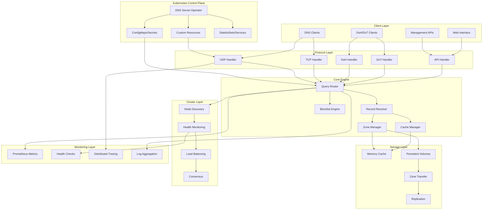

# Design Document

## Overview

The planet-scale DNS server is designed as a high-performance, distributed DNS solution built in Rust using modern async patterns and zero-copy serialization. The architecture emphasizes modularity, scalability, and performance while maintaining compatibility with standard DNS protocols.

The system consists of a lightweight core DNS engine with optional modules for web interface, advanced clustering, and specialized features. The design leverages Tokio for async operations, FlatBuffers for zero-copy serialization, and a custom storage engine optimized for DNS workloads.

## Architecture

### High-Level Architecture



### Core Components Architecture

The system is built around several key components:

1. **Protocol Handlers**: Handle different DNS transport protocols (UDP, TCP, DoH, DoT)
2. **Query Engine**: Routes and processes DNS queries with caching and blocking logic
3. **Storage Engine**: Manages persistent storage and memory caching with FlatBuffers
4. **Cluster Manager**: Handles distributed operations and node coordination
5. **API Server**: Provides REST API for management and optional web interface
6. **Monitoring System**: Collects metrics and provides observability

## Components and Interfaces

### 1. Protocol Layer

#### High-Performance DNS Protocol Handler
```rust
pub trait DnsProtocolHandler {
    async fn handle_query(&self, query: DnsQuery, client_addr: SocketAddr) -> Result<DnsResponse>;
    async fn start_listener(&self, bind_addr: SocketAddr) -> Result<()>;
    fn protocol_type(&self) -> ProtocolType;
    
    // Modern zone transfer (optimized, not BIND-compatible)
    async fn handle_zone_sync(&self, sync_request: ZoneSyncRequest, client_addr: SocketAddr) -> Result<ZoneSyncResponse>;
    async fn handle_dynamic_update(&self, update: DynamicUpdate, client_addr: SocketAddr) -> Result<UpdateResponse>;
    async fn handle_zone_notify(&self, notify: ZoneNotify, client_addr: SocketAddr) -> Result<NotifyResponse>;
}

pub enum ProtocolType {
    Udp,
    Tcp,
    DoH,    // DNS over HTTPS (RFC 8484)
    DoT,    // DNS over TLS (RFC 7858)
    DoQ,    // DNS over QUIC (RFC 9250)
}

// Modern zone synchronization (faster than AXFR/IXFR)
#[derive(Debug, Clone)]
pub struct ZoneSyncRequest {
    pub zone_hash: u64,           // Fast zone identification
    pub last_known_version: u64,  // Version-based sync instead of serial
    pub compression: CompressionType,
    pub auth_token: AuthToken,
}

#[derive(Debug, Clone)]
pub struct ZoneSyncResponse {
    pub zone_data: Bytes,         // Zero-copy FlatBuffer zone data
    pub version: u64,
    pub delta: bool,              // True if incremental, false if full
    pub compression: CompressionType,
}

// Streamlined dynamic updates
#[derive(Debug, Clone)]
pub struct DynamicUpdate {
    pub zone_hash: u64,
    pub operations: Vec<UpdateOperation>,
    pub auth_token: AuthToken,
    pub expected_version: u64,    // Optimistic concurrency control
}

#[derive(Debug, Clone)]
pub enum UpdateOperation {
    Add { name_hash: u64, record_data: Bytes },
    Remove { name_hash: u64, record_type: u16 },
    Replace { name_hash: u64, record_data: Bytes },
}

// Fast zone change notifications
#[derive(Debug, Clone)]
pub struct ZoneNotify {
    pub zone_hash: u64,
    pub new_version: u64,
    pub change_summary: ChangeSummary,
}

#[derive(Debug, Clone)]
pub struct ChangeSummary {
    pub records_added: u32,
    pub records_removed: u32,
    pub records_modified: u32,
    pub affected_names: Vec<u64>, // Hashed domain names
}
```

#### Transport Implementations
- **UDP Handler**: High-performance UDP server using `tokio::net::UdpSocket`
- **TCP Handler**: TCP server for large responses and zone transfers
- **DoH Handler**: HTTP/2 server with DNS-over-HTTPS support
- **DoT Handler**: TLS server for DNS-over-TLS connections

### 2. Query Engine

#### Query Router
```rust
pub struct AtomicQueryRouter {
    resolver: Arc<AtomicZeroCopyResolver>,
    cache: Arc<dyn AtomicZeroCopyCache>,
    blocklist: Arc<AtomicBlocklistEngine>,
    metrics: Arc<AtomicMetricsCollector>,
    
    // Atomic query processing state
    active_queries: AtomicUsize,
    total_queries: AtomicU64,
    last_query_time: AtomicU64,
    
    // Lock-free query queue for batching
    query_queue: Arc<lockfree::queue::Queue<AtomicQuery>>,
    
    // Atomic rate limiting
    rate_limiter: Arc<AtomicRateLimiter>,
}

impl AtomicQueryRouter {
    pub fn route_query_atomic(&self, query: AtomicQuery) -> Result<Arc<[u8]>> {
        // Atomic query processing pipeline
        
        // 1. Atomic rate limiting check
        if !self.rate_limiter.check_atomic(query.client_hash) {
            return Err(DnsServerError::RateLimited);
        }
        
        // 2. Atomic blocklist check (fastest path)
        if self.blocklist.is_blocked_atomic(query.name_hash) {
            self.metrics.blocked_queries.fetch_add(1, Ordering::Relaxed);
            return Ok(self.generate_blocked_response_atomic(query.id));
        }
        
        // 3. Atomic cache lookup (second fastest path)
        if let Some(cached) = self.cache.get_prebuilt_atomic(query.query_hash) {
            self.metrics.cache_hits.fetch_add(1, Ordering::Relaxed);
            return Ok(self.update_response_id_atomic(cached, query.id));
        }
        
        // 4. Atomic zone resolution
        if let Some(response) = self.resolver.resolve_fast_atomic(query.name_hash, query.record_type) {
            // Atomic cache update
            let expires_at = self.calculate_expiry_atomic(&response);
            self.cache.set_prebuilt_atomic(query.query_hash, response.clone(), expires_at);
            
            self.metrics.cache_misses.fetch_add(1, Ordering::Relaxed);
            return Ok(response);
        }
        
        // 5. Return NXDOMAIN atomically
        self.metrics.nxdomain_responses.fetch_add(1, Ordering::Relaxed);
        Ok(self.generate_nxdomain_response_atomic(query.id))
    }
    
    // Atomic batch query processing for maximum throughput
    pub fn route_queries_batch_atomic(&self, queries: &[AtomicQuery]) -> Vec<Result<Arc<[u8]>>> {
        // Process multiple queries atomically for better cache locality
        queries.iter().map(|q| self.route_query_atomic(q.clone())).collect()
    }
}

// Atomic query structure for lock-free processing
#[derive(Debug, Clone)]
pub struct AtomicQuery {
    pub id: u16,
    pub name_hash: u64,              // Pre-computed hash for fast lookup
    pub record_type: u16,
    pub query_hash: u64,             // Pre-computed query hash for cache
    pub client_hash: u64,            // Pre-computed client hash for rate limiting
    pub timestamp: AtomicU64,        // Atomic timestamp
    pub flags: u16,
}

// Lock-free rate limiter using atomic operations
pub struct AtomicRateLimiter {
    // Token bucket per client using atomic operations
    client_buckets: Arc<lockfree::map::Map<u64, Arc<AtomicTokenBucket>>>,
    
    // Global rate limiting
    global_bucket: Arc<AtomicTokenBucket>,
    
    // Atomic configuration
    max_tokens: AtomicU32,
    refill_rate: AtomicU32,
    last_refill: AtomicU64,
}

pub struct AtomicTokenBucket {
    tokens: AtomicU32,
    last_refill: AtomicU64,
    max_tokens: u32,
    refill_rate: u32,
}

impl AtomicTokenBucket {
    pub fn check_atomic(&self, tokens_needed: u32) -> bool {
        // Atomic token bucket algorithm
        let now = SystemTime::now().duration_since(UNIX_EPOCH).unwrap().as_millis() as u64;
        let last_refill = self.last_refill.load(Ordering::Acquire);
        
        // Atomic refill calculation
        if now > last_refill {
            let time_passed = now - last_refill;
            let tokens_to_add = (time_passed * self.refill_rate as u64 / 1000) as u32;
            
            if tokens_to_add > 0 {
                let current_tokens = self.tokens.load(Ordering::Acquire);
                let new_tokens = (current_tokens + tokens_to_add).min(self.max_tokens);
                
                // Atomic compare-and-swap for refill
                if self.tokens.compare_exchange_weak(
                    current_tokens, 
                    new_tokens, 
                    Ordering::AcqRel, 
                    Ordering::Relaxed
                ).is_ok() {
                    self.last_refill.store(now, Ordering::Release);
                }
            }
        }
        
        // Atomic token consumption
        loop {
            let current_tokens = self.tokens.load(Ordering::Acquire);
            if current_tokens < tokens_needed {
                return false;
            }
            
            if self.tokens.compare_exchange_weak(
                current_tokens,
                current_tokens - tokens_needed,
                Ordering::AcqRel,
                Ordering::Relaxed
            ).is_ok() {
                return true;
            }
        }
    }
}
```

#### Ultra-Fast Record Resolver
```rust
pub trait RecordResolver {
    // Zero-copy resolution using hash-based lookups
    async fn resolve_fast(&self, name_hash: u64, record_type: u16) -> Result<Bytes>;
    
    // Batch resolution for multiple queries
    async fn resolve_batch(&self, queries: &[(u64, u16)]) -> Result<Vec<Bytes>>;
    
    // Pre-built response cache lookup (fastest path)
    async fn get_prebuilt_response(&self, query_hash: u64) -> Option<Bytes>;
    
    // DNSSEC-aware resolution
    async fn resolve_with_dnssec(&self, name_hash: u64, record_type: u16, dnssec_ok: bool) -> Result<Bytes>;
    
    // Wildcard and delegation handling
    async fn resolve_with_wildcards(&self, name_hash: u64, record_type: u16) -> Result<Bytes>;
    
    // Recursive resolution for external queries
    async fn resolve_recursive(&self, name_hash: u64, record_type: u16, upstream: &[IpAddr]) -> Result<Bytes>;
}

// Lock-free high-performance resolver
pub struct AtomicZeroCopyResolver {
    // Lock-free hash-indexed zone data
    zone_index: Arc<lockfree::map::Map<u64, Arc<AtomicPtr<MappedZone>>>>,
    
    // Lock-free response cache with atomic operations
    response_cache: Arc<lockfree::map::Map<u64, Arc<AtomicCachedResponse>>>,
    
    // Atomic bloom filter for negative cache
    negative_cache: Arc<AtomicBloomFilter>,
    
    // SIMD-optimized wildcard matcher with atomic pattern updates
    wildcard_matcher: Arc<AtomicSimdMatcher>,
    
    // Lock-free statistics with atomic counters
    stats: Arc<AtomicStats>,
    
    // Atomic cache size tracking
    cache_size: AtomicUsize,
    
    // Atomic eviction counter
    eviction_counter: AtomicU64,
}

// Atomic cached response for lock-free cache operations
pub struct AtomicCachedResponse {
    pub data: Arc<[u8]>,                        // Immutable response data
    pub expires_at: AtomicU64,                  // Atomic expiration timestamp
    pub hit_count: AtomicU64,                   // Atomic hit counter
    pub last_accessed: AtomicU64,               // Atomic last access time
    pub size: AtomicUsize,                      // Atomic size tracking
    pub is_valid: AtomicBool,                   // Atomic validity flag
}

// SIMD-optimized domain name matching
pub struct SimdMatcher {
    // Vectorized pattern matching for wildcard domains
    patterns: Vec<SimdPattern>,
}

impl SimdMatcher {
    pub fn match_wildcard(&self, name_hash: u64, patterns: &[u64]) -> Option<u64> {
        // Use SIMD instructions for parallel pattern matching
        // Much faster than traditional string matching
    }
}

// Lock-free atomic statistics
pub struct AtomicStats {
    pub queries_total: AtomicU64,
    pub cache_hits: AtomicU64,
    pub cache_misses: AtomicU64,
    pub dnssec_queries: AtomicU64,
    pub recursive_queries: AtomicU64,
    pub wildcard_matches: AtomicU64,
}
```

### 3. Storage Engine

#### FlatBuffers Schema for Zero-Copy Storage
```flatbuffers
namespace dns.storage;

// Raw DNS packet stored as-is for zero-copy operations
table DnsPacket {
    raw_data: [uint8]; // Original DNS packet bytes
    parsed_header: DnsHeader; // Pre-parsed header for quick access
    question_offset: uint16; // Byte offset to question section
    answer_offset: uint16; // Byte offset to answer section
    authority_offset: uint16; // Byte offset to authority section
    additional_offset: uint16; // Byte offset to additional section
}

table DnsHeader {
    id: uint16;
    flags: uint16;
    qdcount: uint16;
    ancount: uint16;
    nscount: uint16;
    arcount: uint16;
}

// For structured storage when needed (zone files, API responses)
table DnsRecord {
    name: string;
    record_type: RecordType;
    ttl: uint32;
    data: RecordData;
    created_at: uint64;
    updated_at: uint64;
}

union RecordData {
    ARecord,
    AAAARecord,
    MXRecord,
    CNAMERecord,
    NSRecord,
    PTRRecord
}

table ARecord {
    address: uint32; // IPv4 as uint32
}

table AAAARecord {
    address: [uint8:16]; // IPv6 as byte array
}

// Zone storage optimized for zero-copy access
table Zone {
    name: string;
    serial: uint32;
    // Store zone as pre-built DNS response packets for common queries
    prebuilt_responses: [PrebuiltResponse];
    // Fallback structured records for dynamic queries
    structured_records: [DnsRecord];
    soa: SOARecord;
}

table PrebuiltResponse {
    query_hash: uint64; // Hash of the query (name + type + class)
    response_packet: [uint8]; // Pre-built DNS response packet
    ttl_expires_at: uint64; // When this response expires
}
```

#### Zero-Copy Storage Manager
```rust
pub struct StorageManager {
    memory_cache: Arc<ZeroCopyCache>,
    disk_storage: Arc<ZeroCopyDiskStorage>,
    replication: Arc<ReplicationManager>,
}

pub trait AtomicZeroCopyCache {
    // Lock-free cache operations using atomic compare-and-swap
    fn get_raw_atomic(&self, key: u64) -> Option<Arc<[u8]>>;
    fn set_raw_atomic(&self, key: u64, data: Arc<[u8]>, expires_at: u64) -> bool;
    
    // Atomic pre-built response operations
    fn get_prebuilt_atomic(&self, query_hash: u64) -> Option<Arc<[u8]>>;
    fn set_prebuilt_atomic(&self, query_hash: u64, response: Arc<[u8]>, expires_at: u64) -> bool;
    
    // Atomic batch operations for better performance
    fn get_batch_atomic(&self, keys: &[u64]) -> Vec<Option<Arc<[u8]>>>;
    fn set_batch_atomic(&self, entries: &[(u64, Arc<[u8]>, u64)]) -> Vec<bool>;
    
    // Lock-free invalidation using atomic flags
    fn invalidate_atomic(&self, key: u64) -> bool;
    fn invalidate_pattern_atomic(&self, pattern_hash: u64) -> usize;
    
    // Atomic statistics without locks
    fn stats_atomic(&self) -> AtomicCacheStats;
    
    // Atomic cache maintenance
    fn evict_expired_atomic(&self) -> usize;
    fn compact_atomic(&self) -> bool;
}

pub struct AtomicCacheStats {
    pub total_entries: AtomicUsize,
    pub memory_usage: AtomicUsize,
    pub hit_rate: AtomicU64,        // Stored as fixed-point percentage
    pub miss_rate: AtomicU64,
    pub eviction_count: AtomicU64,
    pub last_updated: AtomicU64,
}

pub trait AtomicZeroCopyDiskStorage {
    // Atomic memory-mapped file access
    fn mmap_zone_atomic(&self, zone_hash: u64) -> Result<Arc<AtomicPtr<MappedZone>>>;
    
    // Atomic zone data operations using compare-and-swap
    fn store_zone_atomic(&self, zone_hash: u64, data: &[u8], expected_version: u64) -> Result<u64>;
    fn load_zone_atomic(&self, zone_hash: u64) -> Result<Arc<[u8]>>;
    
    // Lock-free zone enumeration
    fn list_zones_atomic(&self) -> Vec<u64>;
    
    // Atomic backup operations
    fn backup_incremental_atomic(&self, since_version: u64, target: &Path) -> Result<u64>;
    fn restore_incremental_atomic(&self, backup_path: &Path) -> Result<u64>;
    
    // Atomic zone operations with optimistic concurrency
    fn get_zone_version_atomic(&self, zone_hash: u64) -> Option<u64>;
    fn compare_and_swap_zone(&self, zone_hash: u64, expected_version: u64, new_data: Arc<[u8]>) -> Result<u64>;
    fn get_zone_delta_atomic(&self, zone_hash: u64, from_version: u64, to_version: u64) -> Result<Arc<ZoneDelta>>;
    
    // Atomic metadata operations
    fn update_metadata_atomic(&self, zone_hash: u64, metadata: &AtomicZoneMetadata) -> bool;
    fn get_metadata_atomic(&self, zone_hash: u64) -> Option<Arc<AtomicZoneMetadata>>;
    
    // Lock-free garbage collection
    fn gc_old_versions_atomic(&self, keep_versions: u32) -> usize;
    fn compact_storage_atomic(&self) -> Result<usize>;
}

// Lock-free zone storage using atomic operations
pub struct AtomicHashIndexedStorage {
    // Lock-free hash table for O(1) zone lookup
    zone_index: Arc<lockfree::map::Map<u64, Arc<AtomicZoneMetadata>>>,
    // Atomic pointers to memory-mapped zone data
    zone_data: Arc<lockfree::map::Map<u64, Arc<AtomicPtr<MappedZone>>>>,
    // Lock-free version tracking
    version_log: Arc<AtomicVersionLog>,
    // Global version counter
    global_version: AtomicU64,
}

// All metadata fields use atomic operations
pub struct AtomicZoneMetadata {
    pub hash: u64,                              // Immutable after creation
    pub name: Arc<str>,                         // Immutable string
    pub current_version: AtomicU64,             // Atomic version updates
    pub file_path: Arc<Path>,                   // Immutable path
    pub size: AtomicU64,                        // Atomic size updates
    pub last_modified: AtomicU64,               // Atomic timestamp (as unix timestamp)
    pub record_count: AtomicU32,                // Atomic record count
    pub access_count: AtomicU64,                // Lock-free access tracking
    pub is_loading: AtomicBool,                 // Atomic loading state
}

#[derive(Debug, Clone)]
pub struct ZoneDelta {
    pub from_version: u64,
    pub to_version: u64,
    pub operations: Vec<DeltaOperation>,
    pub compressed_data: Bytes,
}

#[derive(Debug, Clone)]
pub enum DeltaOperation {
    RecordAdded { name_hash: u64, record_type: u16, data_offset: u32 },
    RecordRemoved { name_hash: u64, record_type: u16 },
    RecordModified { name_hash: u64, record_type: u16, data_offset: u32 },
}

// Lock-free version tracking using atomic operations
pub struct AtomicVersionLog {
    // Lock-free append-only log using atomic linked list
    change_log: Arc<lockfree::queue::Queue<Arc<AtomicChangeEntry>>>,
    // Atomic version index using lock-free map
    version_index: Arc<lockfree::map::Map<u64, Arc<lockfree::queue::Queue<usize>>>>,
    // Atomic log size counter
    log_size: AtomicUsize,
    // Atomic compaction trigger
    needs_compaction: AtomicBool,
}

// Atomic change entry for lock-free logging
pub struct AtomicChangeEntry {
    pub version: u64,                           // Immutable after creation
    pub timestamp: AtomicU64,                   // Atomic timestamp
    pub zone_hash: u64,                         // Immutable zone identifier
    pub operation: Arc<DeltaOperation>,         // Immutable operation data
    pub applied: AtomicBool,                    // Atomic application status
    pub next: AtomicPtr<AtomicChangeEntry>,     // Atomic linked list pointer
}
```

// Memory-mapped zone data for zero-copy access
pub struct MappedZone {
    mmap: Mmap,
    zone_data: Zone<'static>, // FlatBuffer root with 'static lifetime from mmap
}

pub struct MappedBuffer {
    mmap: Mmap,
    data: &'static [u8], // Direct reference to mapped memory
}
```

### 4. Cluster Management

#### Node Discovery and Health
```rust
pub struct ClusterManager {
    node_id: NodeId,
    discovery: Arc<dyn NodeDiscovery>,
    health_monitor: Arc<HealthMonitor>,
    consensus: Arc<dyn ConsensusEngine>,
}

pub trait NodeDiscovery {
    async fn register_node(&self, node: NodeInfo) -> Result<()>;
    async fn discover_nodes(&self) -> Result<Vec<NodeInfo>>;
    async fn leave_cluster(&self) -> Result<()>;
}

pub trait ConsensusEngine {
    async fn propose_change(&self, change: ClusterChange) -> Result<()>;
    async fn get_cluster_state(&self) -> Result<ClusterState>;
}
```

#### Zone Transfer Protocol
```rust
pub struct ZoneTransferManager {
    storage: Arc<StorageManager>,
    network: Arc<NetworkManager>,
}

impl ZoneTransferManager {
    pub async fn initiate_axfr(&self, zone: &str, primary: SocketAddr) -> Result<()>;
    pub async fn handle_axfr_request(&self, zone: &str, client: SocketAddr) -> Result<()>;
    pub async fn initiate_ixfr(&self, zone: &str, serial: u32, primary: SocketAddr) -> Result<()>;
}
```

### 5. API Server

#### REST API Design
```rust
pub struct ApiServer {
    query_engine: Arc<QueryRouter>,
    storage: Arc<StorageManager>,
    cluster: Arc<ClusterManager>,
    auth: Arc<AuthManager>,
}

// API Endpoints:
// GET /api/v1/zones - List all zones
// POST /api/v1/zones - Create new zone
// GET /api/v1/zones/{zone}/records - Get zone records
// POST /api/v1/zones/{zone}/records - Add record
// PUT /api/v1/zones/{zone}/records/{id} - Update record
// DELETE /api/v1/zones/{zone}/records/{id} - Delete record
// GET /api/v1/blocklist - Get blocked domains
// POST /api/v1/blocklist - Add blocked domain
// DELETE /api/v1/blocklist/{domain} - Remove blocked domain
// GET /api/v1/cluster/nodes - Get cluster nodes
// GET /api/v1/metrics - Get server metrics
// POST /api/v1/zones/{zone}/transfer - Initiate zone transfer
```

### 6. Optional Web Interface Module

#### Modular Web Interface
```rust
#[cfg(feature = "web-interface")]
pub struct WebInterfaceModule {
    api_client: Arc<ApiClient>,
    static_files: StaticFileHandler,
    websocket_manager: Arc<WebSocketManager>,
    auth_provider: Arc<AuthProvider>,
    dashboard: Arc<DashboardEngine>,
}

// Separate crate: dns-server-web
// - React/Vue.js frontend with TypeScript
// - WebSocket for real-time updates
// - Responsive design with mobile support
// - Multi-factor authentication
// - Role-based UI components
// - Real-time charts and graphs
// - Dark/light theme support
// - Internationalization (i18n)
```

### 7. Advanced Monitoring and Observability

#### Metrics Collection
```rust
pub struct MetricsCollector {
    prometheus_registry: Arc<Registry>,
    custom_metrics: Arc<CustomMetrics>,
    trace_collector: Arc<TraceCollector>,
    log_aggregator: Arc<LogAggregator>,
}

pub struct CustomMetrics {
    query_latency: HistogramVec,
    cache_hit_ratio: GaugeVec,
    zone_transfer_duration: HistogramVec,
    blocked_queries: CounterVec,
    cluster_health: GaugeVec,
    memory_usage: GaugeVec,
    network_throughput: GaugeVec,
}
```

### 8. Machine Learning and AI Features

#### Intelligent Query Processing
```rust
pub struct MLEngine {
    query_predictor: Arc<QueryPredictor>,
    anomaly_detector: Arc<AnomalyDetector>,
    cache_optimizer: Arc<CacheOptimizer>,
    threat_classifier: Arc<ThreatClassifier>,
}

pub trait QueryPredictor {
    async fn predict_next_queries(&self, context: &QueryContext) -> Vec<PredictedQuery>;
    async fn update_model(&self, query_history: &[Query]);
}

pub trait AnomalyDetector {
    async fn detect_anomalies(&self, metrics: &MetricsSnapshot) -> Vec<Anomaly>;
    async fn classify_threat_level(&self, anomaly: &Anomaly) -> ThreatLevel;
}
```

### 9. Advanced Caching Strategies

#### Multi-Tier Caching System
```rust
pub struct AdvancedCacheManager {
    l1_cache: Arc<CPUCache>,        // CPU cache-friendly hot data
    l2_cache: Arc<MemoryCache>,     // Main memory cache
    l3_cache: Arc<SSDCache>,        // SSD-based cache
    l4_cache: Arc<NetworkCache>,    // Distributed cache
    cache_coordinator: Arc<CacheCoordinator>,
}

pub struct CacheCoordinator {
    eviction_policy: Arc<dyn EvictionPolicy>,
    prefetch_engine: Arc<PrefetchEngine>,
    compression_engine: Arc<CompressionEngine>,
    cache_analytics: Arc<CacheAnalytics>,
}
```

### 10. Security Intelligence Platform

#### Threat Intelligence Integration
```rust
pub struct SecurityIntelligence {
    threat_feeds: Arc<ThreatFeedManager>,
    reputation_engine: Arc<ReputationEngine>,
    malware_detector: Arc<MalwareDetector>,
    forensics_engine: Arc<ForensicsEngine>,
}

pub trait ThreatFeedManager {
    async fn update_feeds(&self) -> Result<()>;
    async fn check_domain_reputation(&self, domain: &str) -> ReputationScore;
    async fn check_ip_reputation(&self, ip: IpAddr) -> ReputationScore;
}
```

### 11. Kubernetes Operator

#### DNS Server Operator Architecture
```rust
// Separate crate: dns-server-operator
use kube::{Api, Client, CustomResource};
use schemars::JsonSchema;
use serde::{Deserialize, Serialize};

#[derive(CustomResource, Debug, Serialize, Deserialize, Default, Clone, JsonSchema)]
#[kube(group = "dns.io", version = "v1", kind = "DnsServer", namespaced)]
#[kube(status = "DnsServerStatus")]
#[kube(derive="Default")]
pub struct DnsServerSpec {
    /// Number of DNS server replicas
    pub replicas: i32,
    
    /// DNS server configuration
    pub config: DnsServerConfig,
    
    /// Storage configuration
    pub storage: StorageConfig,
    
    /// Clustering configuration
    pub cluster: ClusterConfig,
    
    /// Security configuration
    pub security: SecurityConfig,
    
    /// Performance tuning
    pub performance: PerformanceConfig,
    
    /// Monitoring configuration
    pub monitoring: MonitoringConfig,
}

#[derive(Debug, Serialize, Deserialize, Clone, JsonSchema)]
pub struct DnsServerConfig {
    /// Bind addresses for different protocols
    pub bind_addresses: BindAddresses,
    
    /// Zone configurations
    pub zones: Vec<ZoneConfig>,
    
    /// Blocklist configuration
    pub blocklist: BlocklistConfig,
    
    /// Upstream DNS servers
    pub upstreams: Vec<UpstreamConfig>,
}

#[derive(Debug, Serialize, Deserialize, Clone, JsonSchema)]
pub struct StorageConfig {
    /// Storage class for persistent volumes
    pub storage_class: Option<String>,
    
    /// Storage size
    pub size: String,
    
    /// Backup configuration
    pub backup: BackupConfig,
}

#[derive(Debug, Serialize, Deserialize, Clone, JsonSchema)]
pub struct ClusterConfig {
    /// Enable clustering
    pub enabled: bool,
    
    /// Cluster discovery method
    pub discovery: ClusterDiscovery,
    
    /// Zone transfer configuration
    pub zone_transfer: ZoneTransferConfig,
}

#[derive(Debug, Serialize, Deserialize, Clone, JsonSchema)]
pub struct SecurityConfig {
    /// Enable DNSSEC
    pub dnssec: bool,
    
    /// TLS configuration
    pub tls: TlsConfig,
    
    /// Access control lists
    pub acl: Vec<AclRule>,
    
    /// Rate limiting configuration
    pub rate_limiting: RateLimitConfig,
}

#[derive(Debug, Serialize, Deserialize, Clone, JsonSchema)]
pub struct DnsServerStatus {
    /// Current phase of the DNS server
    pub phase: String,
    
    /// Number of ready replicas
    pub ready_replicas: i32,
    
    /// Cluster status
    pub cluster_status: ClusterStatus,
    
    /// Health status
    pub health: HealthStatus,
    
    /// Last reconciliation time
    pub last_reconciled: Option<String>,
}
```

#### Operator Controller Logic
```rust
pub struct DnsServerController {
    client: Client,
    dns_servers: Api<DnsServer>,
    deployments: Api<Deployment>,
    services: Api<Service>,
    config_maps: Api<ConfigMap>,
    secrets: Api<Secret>,
    persistent_volume_claims: Api<PersistentVolumeClaim>,
}

impl DnsServerController {
    pub async fn reconcile(&self, dns_server: &DnsServer) -> Result<Action> {
        // 1. Validate the DNS server specification
        self.validate_spec(&dns_server.spec)?;
        
        // 2. Create or update ConfigMap with DNS server configuration
        self.reconcile_config_map(dns_server).await?;
        
        // 3. Create or update Secrets for TLS certificates and keys
        self.reconcile_secrets(dns_server).await?;
        
        // 4. Create or update PersistentVolumeClaims for storage
        self.reconcile_storage(dns_server).await?;
        
        // 5. Create or update StatefulSet for DNS server pods
        self.reconcile_stateful_set(dns_server).await?;
        
        // 6. Create or update Services for DNS protocols
        self.reconcile_services(dns_server).await?;
        
        // 7. Create or update ServiceMonitor for Prometheus
        self.reconcile_monitoring(dns_server).await?;
        
        // 8. Update status
        self.update_status(dns_server).await?;
        
        Ok(Action::requeue(Duration::from_secs(300)))
    }
    
    async fn reconcile_stateful_set(&self, dns_server: &DnsServer) -> Result<()> {
        let stateful_set = StatefulSet {
            metadata: ObjectMeta {
                name: Some(format!("{}-dns", dns_server.name_any())),
                namespace: dns_server.namespace(),
                labels: Some(self.common_labels(dns_server)),
                ..Default::default()
            },
            spec: Some(StatefulSetSpec {
                replicas: Some(dns_server.spec.replicas),
                selector: LabelSelector {
                    match_labels: Some(self.selector_labels(dns_server)),
                    ..Default::default()
                },
                template: PodTemplateSpec {
                    metadata: Some(ObjectMeta {
                        labels: Some(self.common_labels(dns_server)),
                        ..Default::default()
                    }),
                    spec: Some(self.build_pod_spec(dns_server)?),
                },
                service_name: format!("{}-dns-headless", dns_server.name_any()),
                volume_claim_templates: Some(self.build_volume_claim_templates(dns_server)?),
                ..Default::default()
            }),
            ..Default::default()
        };
        
        self.deployments.patch(
            &stateful_set.name_any(),
            &PatchParams::apply("dns-server-operator"),
            &Patch::Apply(&stateful_set),
        ).await?;
        
        Ok(())
    }
}
```

#### Custom Resource Definitions (CRDs)
The operator will manage several custom resources:

1. **DnsServer**: Main DNS server configuration
2. **DnsZone**: Individual DNS zone management
3. **DnsBlocklist**: Blocklist configuration and management
4. **DnsCluster**: Multi-region cluster configuration

#### Operator Features
- **Automated Deployment**: Deploy DNS servers with best practices
- **Configuration Management**: Hot-reload configuration changes
- **Certificate Management**: Automatic TLS certificate provisioning and renewal
- **Backup Management**: Automated backups to object storage
- **Health Monitoring**: Continuous health checks and automatic recovery
- **Scaling**: Automatic horizontal and vertical scaling
- **Zone Management**: Declarative zone configuration
- **Cluster Coordination**: Multi-region cluster setup and management
- **Upgrade Management**: Rolling upgrades with zero downtime
- **Disaster Recovery**: Automated failover and recovery procedures

## Data Models

### Core DNS Data Structures

#### DNS Query and Response
```rust
#[derive(Debug, Clone)]
pub struct DnsQuery {
    pub id: u16,
    pub question: Question,
    pub flags: QueryFlags,
    pub client_addr: SocketAddr,
    pub protocol: ProtocolType,
}

#[derive(Debug, Clone)]
pub struct DnsResponse {
    pub id: u16,
    pub flags: ResponseFlags,
    pub questions: Vec<Question>,
    pub answers: Vec<ResourceRecord>,
    pub authorities: Vec<ResourceRecord>,
    pub additionals: Vec<ResourceRecord>,
}
```

#### Complete DNS Resource Records (BIND Compatible)
```rust
#[derive(Debug, Clone)]
pub enum ResourceRecord {
    // Standard Records
    A { name: String, ttl: u32, address: Ipv4Addr },
    AAAA { name: String, ttl: u32, address: Ipv6Addr },
    CNAME { name: String, ttl: u32, cname: String },
    MX { name: String, ttl: u32, priority: u16, exchange: String },
    NS { name: String, ttl: u32, nsdname: String },
    PTR { name: String, ttl: u32, ptrdname: String },
    SOA { name: String, ttl: u32, soa: SoaData },
    TXT { name: String, ttl: u32, text: Vec<String> },
    SRV { name: String, ttl: u32, priority: u16, weight: u16, port: u16, target: String },
    
    // DNSSEC Records
    DNSKEY { name: String, ttl: u32, flags: u16, protocol: u8, algorithm: u8, public_key: Vec<u8> },
    DS { name: String, ttl: u32, key_tag: u16, algorithm: u8, digest_type: u8, digest: Vec<u8> },
    RRSIG { name: String, ttl: u32, type_covered: u16, algorithm: u8, labels: u8, original_ttl: u32, expiration: u32, inception: u32, key_tag: u16, signer: String, signature: Vec<u8> },
    NSEC { name: String, ttl: u32, next_domain: String, type_bitmaps: Vec<u8> },
    NSEC3 { name: String, ttl: u32, hash_algorithm: u8, flags: u8, iterations: u16, salt: Vec<u8>, next_hashed_owner: Vec<u8>, type_bitmaps: Vec<u8> },
    NSEC3PARAM { name: String, ttl: u32, hash_algorithm: u8, flags: u8, iterations: u16, salt: Vec<u8> },
    
    // Extended Records
    HINFO { name: String, ttl: u32, cpu: String, os: String },
    MINFO { name: String, ttl: u32, rmailbx: String, emailbx: String },
    WKS { name: String, ttl: u32, address: Ipv4Addr, protocol: u8, bitmap: Vec<u8> },
    RP { name: String, ttl: u32, mbox: String, txt: String },
    AFSDB { name: String, ttl: u32, subtype: u16, hostname: String },
    X25 { name: String, ttl: u32, psdn_address: String },
    ISDN { name: String, ttl: u32, isdn_address: String, sa: Option<String> },
    RT { name: String, ttl: u32, preference: u16, intermediate: String },
    
    // Location and Geographic Records
    LOC { name: String, ttl: u32, version: u8, size: u8, horiz_pre: u8, vert_pre: u8, latitude: u32, longitude: u32, altitude: u32 },
    GPOS { name: String, ttl: u32, longitude: String, latitude: String, altitude: String },
    
    // Security and Certificate Records
    CERT { name: String, ttl: u32, cert_type: u16, key_tag: u16, algorithm: u8, certificate: Vec<u8> },
    KEY { name: String, ttl: u32, flags: u16, protocol: u8, algorithm: u8, public_key: Vec<u8> },
    SIG { name: String, ttl: u32, type_covered: u16, algorithm: u8, labels: u8, original_ttl: u32, expiration: u32, inception: u32, key_tag: u16, signer: String, signature: Vec<u8> },
    
    // IPv6 and Modern Records
    A6 { name: String, ttl: u32, prefix_len: u8, address_suffix: Vec<u8>, prefix_name: Option<String> },
    DNAME { name: String, ttl: u32, target: String },
    
    // Application-Specific Records
    NAPTR { name: String, ttl: u32, order: u16, preference: u16, flags: String, service: String, regexp: String, replacement: String },
    KX { name: String, ttl: u32, preference: u16, exchanger: String },
    
    // Newer Record Types
    SSHFP { name: String, ttl: u32, algorithm: u8, fp_type: u8, fingerprint: Vec<u8> },
    IPSECKEY { name: String, ttl: u32, precedence: u8, gateway_type: u8, algorithm: u8, gateway: String, public_key: Vec<u8> },
    DHCID { name: String, ttl: u32, digest: Vec<u8> },
    TLSA { name: String, ttl: u32, cert_usage: u8, selector: u8, matching_type: u8, cert_data: Vec<u8> },
    SMIMEA { name: String, ttl: u32, cert_usage: u8, selector: u8, matching_type: u8, cert_data: Vec<u8> },
    
    // HTTP and Web Records
    HTTPS { name: String, ttl: u32, priority: u16, target: String, params: Vec<HttpsParam> },
    SVCB { name: String, ttl: u32, priority: u16, target: String, params: Vec<SvcParam> },
    
    // CAA (Certificate Authority Authorization)
    CAA { name: String, ttl: u32, flags: u8, tag: String, value: String },
    
    // URI Record
    URI { name: String, ttl: u32, priority: u16, weight: u16, target: String },
    
    // OPENPGPKEY
    OPENPGPKEY { name: String, ttl: u32, key_data: Vec<u8> },
    
    // Generic/Unknown Record Types
    Unknown { name: String, ttl: u32, record_type: u16, data: Vec<u8> },
}

#[derive(Debug, Clone)]
pub struct HttpsParam {
    pub key: u16,
    pub value: Vec<u8>,
}

#[derive(Debug, Clone)]
pub struct SvcParam {
    pub key: u16,
    pub value: Vec<u8>,
}
```

### Storage Models

#### Zone Data Structure
```rust
pub struct Zone {
    pub name: String,
    pub serial: u32,
    pub refresh: u32,
    pub retry: u32,
    pub expire: u32,
    pub minimum: u32,
    pub records: HashMap<String, Vec<ResourceRecord>>,
    pub last_modified: SystemTime,
}
```

#### Cache Entry
```rust
pub struct CacheEntry {
    pub record: ResourceRecord,
    pub inserted_at: Instant,
    pub access_count: u64,
    pub last_accessed: Instant,
}
```

### Cluster Models

#### Node Information
```rust
#[derive(Debug, Clone, Serialize, Deserialize)]
pub struct NodeInfo {
    pub id: NodeId,
    pub address: SocketAddr,
    pub role: NodeRole,
    pub status: NodeStatus,
    pub load: f64,
    pub zones: Vec<String>,
    pub last_seen: SystemTime,
}

#[derive(Debug, Clone)]
pub enum NodeRole {
    Primary,
    Secondary,
    Cache,
}
```

## Error Handling

### Error Types
```rust
#[derive(Debug, thiserror::Error)]
pub enum DnsServerError {
    #[error("Protocol error: {0}")]
    Protocol(#[from] ProtocolError),
    
    #[error("Storage error: {0}")]
    Storage(#[from] StorageError),
    
    #[error("Network error: {0}")]
    Network(#[from] NetworkError),
    
    #[error("Cluster error: {0}")]
    Cluster(#[from] ClusterError),
    
    #[error("Configuration error: {0}")]
    Config(String),
    
    #[error("Authentication error: {0}")]
    Auth(String),
}
```

### Error Recovery Strategies
1. **Query Failures**: Return appropriate DNS error codes (SERVFAIL, NXDOMAIN)
2. **Storage Failures**: Fallback to cache, log errors, attempt recovery
3. **Network Failures**: Retry with exponential backoff, circuit breaker pattern
4. **Cluster Failures**: Graceful degradation, automatic failover
5. **Configuration Errors**: Validation on startup, safe defaults

## Testing Strategy

### Unit Testing
- Individual component testing with mock dependencies
- Property-based testing for DNS protocol compliance
- Performance benchmarks for critical paths
- Memory usage and leak detection

### Integration Testing
- End-to-end DNS query/response testing
- Zone transfer testing between nodes
- API endpoint testing with various scenarios
- Cache behavior and eviction testing

### Load Testing
- High-concurrency query testing
- Memory pressure testing
- Network partition simulation
- Cluster failover testing

### Compliance Testing
- RFC compliance testing for DNS protocols
- DNSSEC validation testing
- DoH/DoT protocol compliance
- Security vulnerability testing

## Performance Considerations

### True Zero-Copy Pipeline
- **Network to Cache**: Raw DNS packets stored as FlatBuffer bytes without parsing
- **Cache to Response**: Pre-built response packets served directly from memory
- **Disk Storage**: Memory-mapped FlatBuffer files for zero-copy disk access
- **Query Processing**: FlatBuffer accessors work directly on mapped memory
- **Response Generation**: Pre-built responses eliminate serialization overhead
- **Zone Transfers**: FlatBuffer zone data transferred without conversion
- **API Responses**: JSON generated directly from FlatBuffer data using zero-copy accessors

#### Zero-Copy Implementation Details
```rust
// Example: Zero-copy query processing
pub async fn process_query_zero_copy(&self, raw_query: Bytes) -> Result<Bytes> {
    // 1. Parse query header without copying data
    let query_header = parse_dns_header(&raw_query)?;
    let query_hash = calculate_query_hash(&raw_query);
    
    // 2. Check for pre-built response (ultimate zero-copy)
    if let Some(prebuilt) = self.cache.get_prebuilt_response(query_hash).await {
        // Update ID in response and return - minimal copying
        return Ok(update_response_id(prebuilt, query_header.id));
    }
    
    // 3. Access zone data via memory mapping
    let zone = self.storage.mmap_zone(&extract_zone_name(&raw_query)?).await?;
    
    // 4. Build response using FlatBuffer builders (minimal allocation)
    let response = build_response_from_zone(&zone, &raw_query)?;
    
    // 5. Cache the response for future zero-copy serving
    self.cache.set_prebuilt_response(query_hash, response.clone(), ttl).await;
    
    Ok(response)
}
```

### Cloud-Native Async Performance
- **Tokio Runtime Optimization**: Custom runtime configuration for DNS workloads
- **Container-Aware Resource Management**: Respect cgroup limits and requests
- **Kubernetes-Native Scaling**: Horizontal Pod Autoscaler integration
- **Work-Stealing Scheduler**: Optimized Tokio scheduler configuration
- **Batch Processing**: Group operations to reduce syscall overhead
- **Lock-Free Data Structures**: Crossbeam, atomic operations, RCU patterns
- **Coroutine Pooling**: Reuse async task contexts to reduce allocation
- **Resource Limit Awareness**: Adapt performance based on container resource limits

### Memory Management Optimization
- **Custom Allocators**: jemalloc, mimalloc for better performance
- **Memory Pools**: Pre-allocated pools for common data structures
- **Arena Allocation**: Bump allocators for temporary data
- **Huge Pages**: Use 2MB/1GB pages for large data structures
- **Memory Prefetching**: CPU cache optimization with prefetch hints
- **Garbage Collection Avoidance**: Minimize allocations in hot paths
- **Memory Compression**: LZ4/Zstd compression for cold cache data
- **NUMA-Aware Allocation**: Allocate memory on local NUMA nodes

### Container-Friendly Network Optimization
- **SO_REUSEPORT**: Multiple sockets bound to same port for load balancing
- **Connection Pooling**: Efficient connection reuse for outbound requests
- **TCP Fast Open**: Reduce connection establishment latency where supported
- **HTTP/2 Multiplexing**: Efficient DoH connections with connection reuse
- **QUIC Protocol Support**: HTTP/3 for DoH with improved performance
- **Kubernetes Service Integration**: Leverage Kubernetes networking features
- **CNI Plugin Compatibility**: Work efficiently with various CNI plugins
- **Network Policy Compliance**: Respect Kubernetes network policies

### Caching Performance
- **Multi-Level Caching**: L1 (CPU cache), L2 (RAM), L3 (SSD), L4 (HDD)
- **Cache Warming**: Proactive cache population based on query patterns
- **Bloom Filters**: Fast negative cache lookups
- **Consistent Hashing**: Distribute cache across multiple nodes
- **Cache Compression**: Compress cached data to fit more in memory
- **TTL Optimization**: Dynamic TTL adjustment based on query frequency
- **Predictive Caching**: ML-based cache pre-loading
- **Cache Partitioning**: Separate caches for different query types

### Cloud-Native Database Performance
- **Write-Ahead Logging (WAL)**: Fast writes with durability guarantees
- **LSM Trees**: Log-structured merge trees for write-heavy workloads
- **Async I/O**: Non-blocking I/O operations using Tokio
- **Persistent Volume Optimization**: Efficient use of Kubernetes persistent volumes
- **Cloud Storage Integration**: Support for cloud-native storage (EBS, GCE PD, etc.)
- **Database Sharding**: Horizontal partitioning across multiple pods
- **StatefulSet Integration**: Proper handling of persistent storage in Kubernetes
- **Backup to Object Storage**: Incremental backups to S3/GCS/Azure Blob

### CPU Performance Optimization
- **SIMD Instructions**: Vectorized operations for string matching and hashing
- **Branch Prediction Optimization**: Minimize branch mispredictions
- **Cache-Friendly Data Structures**: Optimize for CPU cache line size
- **Profile-Guided Optimization (PGO)**: Compiler optimizations based on runtime profiles
- **Link-Time Optimization (LTO)**: Whole-program optimization
- **CPU-Specific Builds**: Optimize for specific CPU architectures
- **Parallel Processing**: Multi-threaded processing where beneficial
- **Hot Path Optimization**: Inline critical functions, minimize function calls

### Kubernetes-Native Load Balancing and Scaling
- **Kubernetes Service Integration**: Leverage built-in load balancing
- **Ingress Controller Support**: Work with various ingress controllers
- **Horizontal Pod Autoscaling (HPA)**: CPU/memory-based scaling
- **Vertical Pod Autoscaling (VPA)**: Automatic resource request optimization
- **Custom Metrics Scaling**: Scale based on DNS query rate and latency
- **Multi-Zone Deployment**: Distribute pods across availability zones
- **Pod Disruption Budgets**: Ensure availability during updates
- **Rolling Updates**: Zero-downtime deployments with health checks

### Monitoring and Profiling
- **Continuous Profiling**: Always-on CPU and memory profiling
- **Distributed Tracing**: OpenTelemetry integration for request tracing
- **Real-Time Metrics**: Sub-second metric collection and reporting
- **Performance Regression Detection**: Automated detection of performance issues
- **Flame Graphs**: Visual performance analysis
- **Memory Leak Detection**: Automated memory leak detection and reporting
- **Latency Percentiles**: Track P50, P95, P99, P99.9 latencies
- **Custom Metrics**: Application-specific performance metrics

## Security Considerations

### Advanced DDoS Protection
- **Adaptive Rate Limiting**: Machine learning-based rate limiting that adapts to traffic patterns
- **Query Complexity Analysis**: Detect and block computationally expensive queries
- **Amplification Attack Prevention**: Limit response sizes, detect reflection attacks
- **Botnet Detection**: Pattern analysis to identify coordinated attacks
- **Geographic Rate Limiting**: Different limits based on client geographic location
- **Protocol-Specific Limits**: Separate limits for UDP, TCP, DoH, DoT
- **Burst Protection**: Token bucket algorithm with burst allowances
- **Circuit Breaker Pattern**: Automatic service degradation under extreme load

### Input Validation and Sanitization
- **Strict DNS Packet Parsing**: Bounds checking with safe parsing libraries
- **Domain Name Validation**: IDN normalization, punycode validation, length limits
- **Query Type Validation**: Whitelist of supported query types
- **Compression Pointer Validation**: Prevent DNS compression attacks
- **Label Length Validation**: RFC-compliant label and name length checking
- **Character Set Validation**: Strict ASCII/UTF-8 validation for domain names
- **Malformed Packet Detection**: Detect and log suspicious packet structures

### Access Control and Authentication
- **Multi-Layer ACLs**: IP-based, subnet-based, and geographic access control
- **API Authentication**: JWT tokens, API keys, OAuth2, mTLS client certificates
- **Role-Based Access Control (RBAC)**: Granular permissions for different operations
- **Time-Based Access Control**: Restrict access to certain time windows
- **Source Validation**: Verify legitimate DNS clients and block suspicious sources
- **Admin Interface Security**: Multi-factor authentication, session management
- **Service Account Management**: Separate credentials for automated systems

### Cryptographic Security
- **TLS 1.3 Everywhere**: DoT, DoH, management interfaces, cluster communication
- **Perfect Forward Secrecy**: Ephemeral key exchange for all TLS connections
- **Certificate Management**: Automatic certificate renewal, OCSP stapling
- **DNSSEC Full Support**: Signing, validation, key rollover automation
- **Cryptographic Agility**: Support for multiple cipher suites and key sizes
- **Hardware Security Modules (HSM)**: Support for HSM-based key storage
- **Secure Random Generation**: Hardware-based entropy sources
- **Key Derivation**: PBKDF2/Argon2 for password-based keys

### Advanced Threat Detection
- **Anomaly Detection**: ML-based detection of unusual query patterns
- **DNS Tunneling Detection**: Identify data exfiltration via DNS
- **Domain Generation Algorithm (DGA) Detection**: Identify malware-generated domains
- **Fast Flux Detection**: Detect rapidly changing DNS records
- **Typosquatting Detection**: Identify domains similar to legitimate ones
- **Threat Intelligence Integration**: Real-time feeds of malicious domains
- **Behavioral Analysis**: Track client behavior patterns over time
- **Honeypot Integration**: Deploy DNS honeypots to detect attackers

### Data Protection and Privacy
- **Query Logging Controls**: Configurable logging with privacy options
- **Data Retention Policies**: Automatic purging of old logs and data
- **Anonymization**: Hash or anonymize client IP addresses in logs
- **GDPR Compliance**: Right to erasure, data portability, consent management
- **Encryption at Rest**: All stored data encrypted with AES-256
- **Memory Protection**: Secure memory allocation, memory scrubbing
- **Audit Trails**: Immutable audit logs for all administrative actions

### Network Security
- **Network Segmentation**: Separate networks for management, cluster, and client traffic
- **Firewall Integration**: Dynamic firewall rule updates based on threat detection
- **VPN Support**: Site-to-site VPN for cluster communication
- **Network Monitoring**: Deep packet inspection for DNS traffic analysis
- **BGP Security**: BGP route validation and hijack detection
- **Anycast Security**: Secure anycast deployment with route monitoring